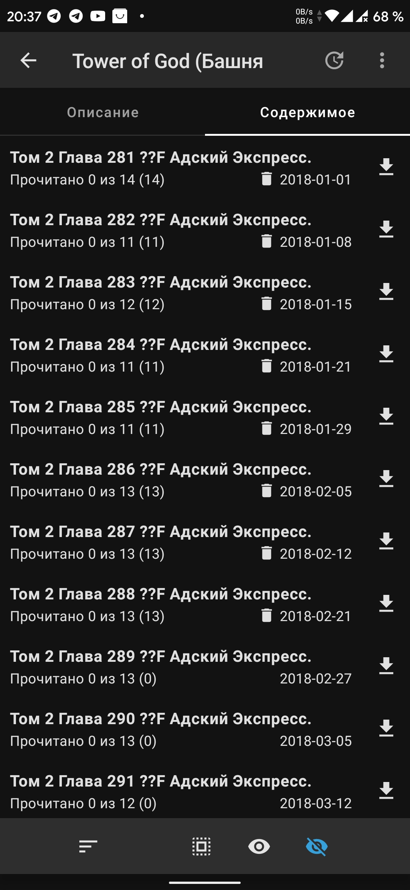
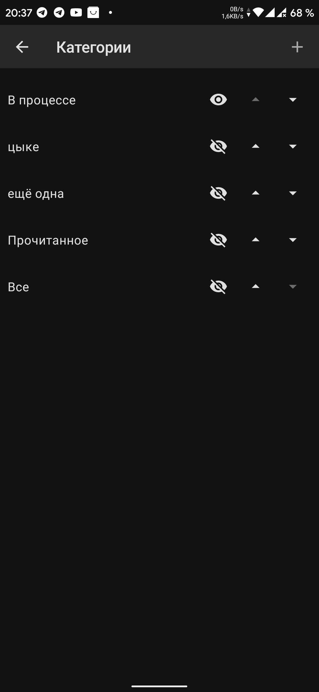
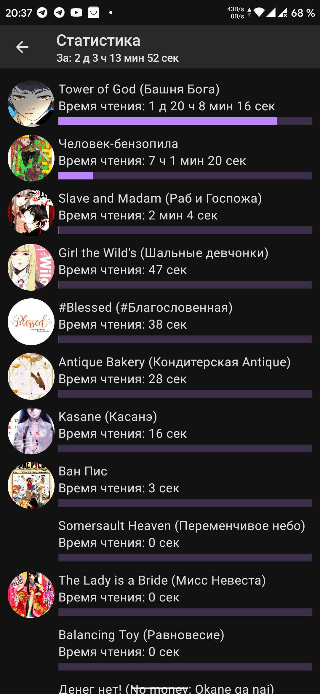
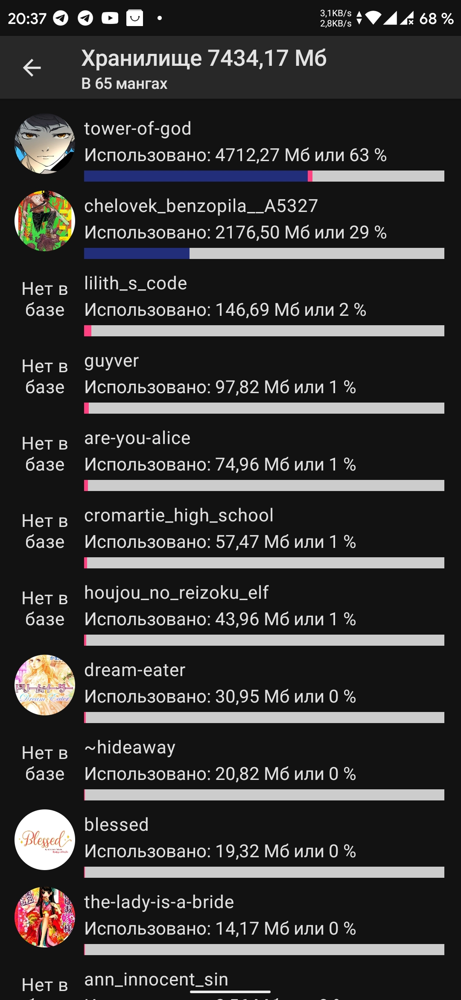
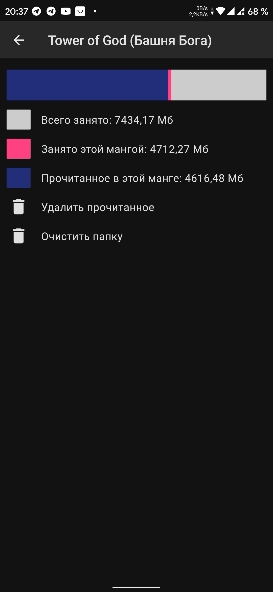
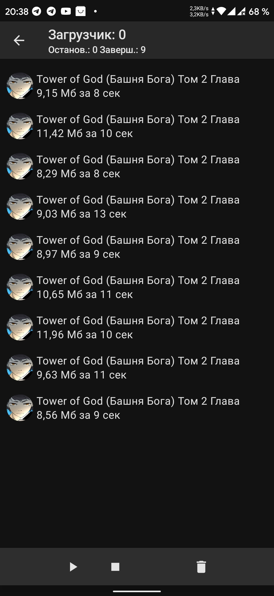
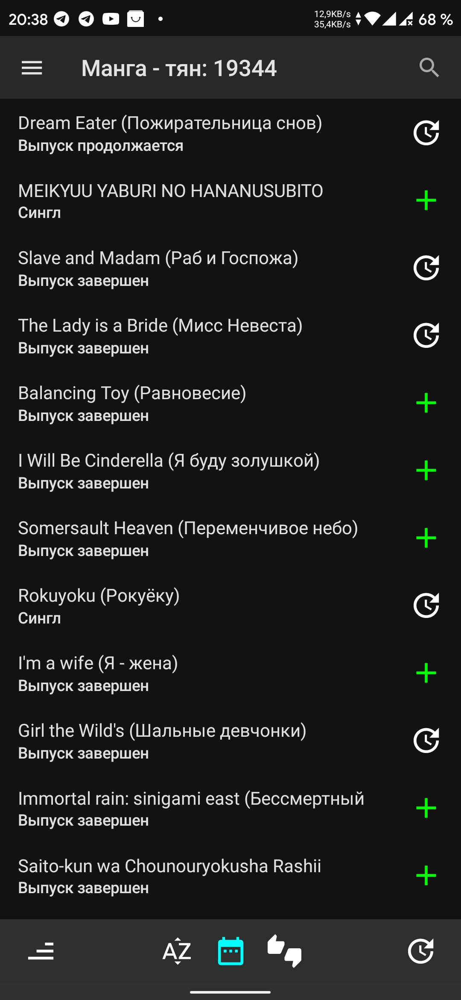
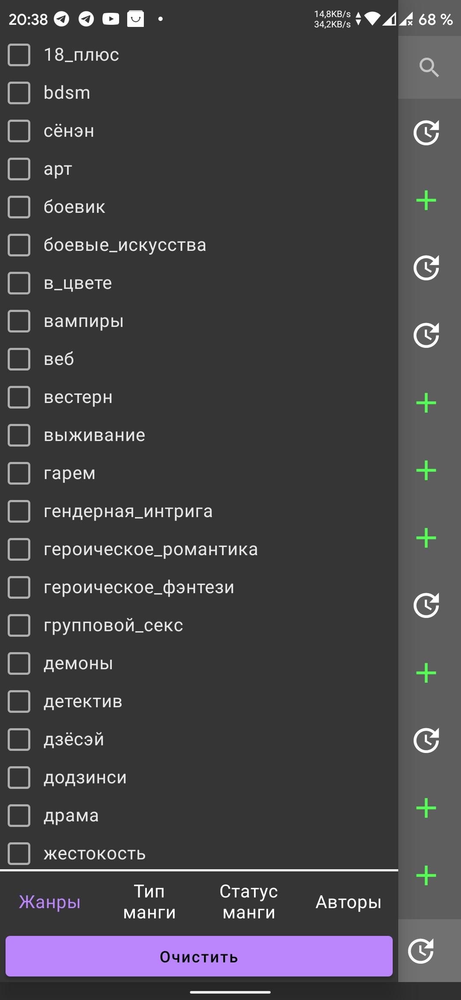
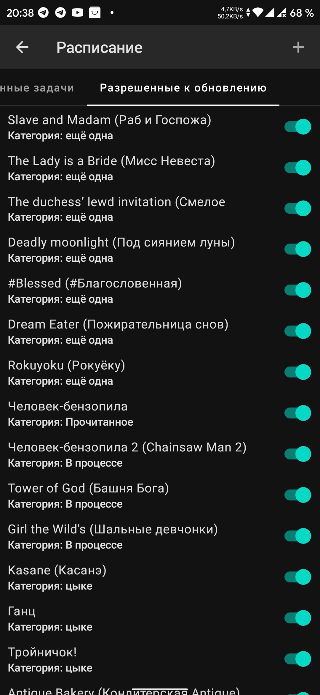
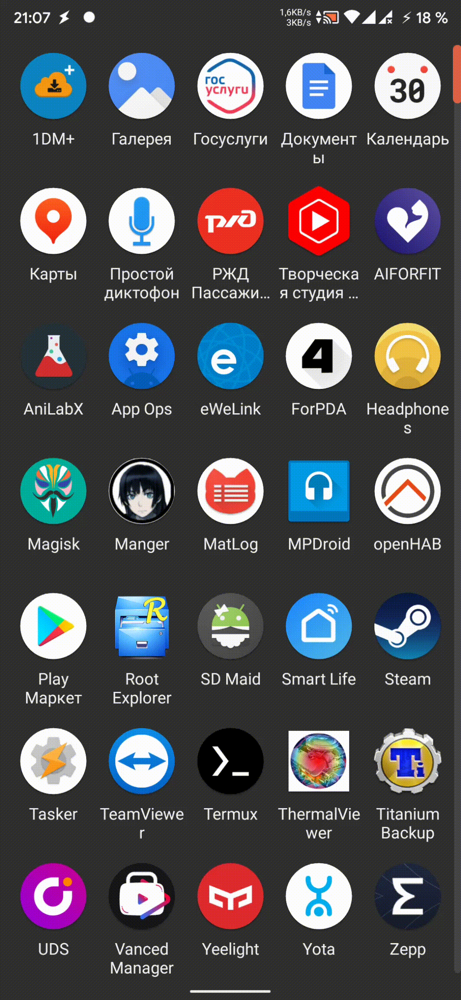

Manger (MANGa readER)
===================
### Manga reading app

[Application page](https://4pda.to/forum/index.php?showtopic=772886&st=80)

### Architecture

* MVVM - [Guide to app architecture](https://developer.android.com/jetpack/guide)
* [Kotlin](https://kotlinlang.org/) 100%, [Coroutines](https://github.com/Kotlin/kotlinx.coroutines),
  [Flow](https://kotlinlang.org/docs/flow.html)

### Preview

  
Many screenshots

    

      
      
      
      
      
      
      
      
      
      
      
      
      
      
      
      
      
    

  
Many heavy gif

    
  
    

        
<b>"Library And Categories"</b> Screens

        

        
        
        
<b>"Drawer menu"</b>

        
    

    

    

        
<b>"Chapters of Manga"</b> Screen

        
        
    

    

    

        
<b>"Statistic"</b> Screen

        
    

    

    

        
<b>"Storage"</b> Screen

        
    

    

    

        
<b>"Site Catalog"</b> Screen

        
    

    

    

        
<b>"Single Site"</b> Screen

        
    

    

    

        
<b>"Global Search"</b> Screen

        
    

    

    

        
<b>"Downloads"</b> Screen

        
        
<b>"Downloads"</b> Notification

        
    

    

    

        
<b>"Last Added Chapters"</b> Screen

        
    

    

    

        
<b>"Scheduler"</b> Screen

        
    

    

    

        
<b>"Settings"</b> Screen

        
        
<b>"Change order drawer menu"</b>

        
    

    

    

        
<b>"App launch - Splash"</b> Screen

        
    

    

    

        
<b>"Downloads"</b> Screen

    

### Libraries

* Accompanist
    * [Insets](https://google.github.io/accompanist/insets/)
    * [Permissions](https://google.github.io/accompanist/permissions/)
    * [Flow Layouts](https://google.github.io/accompanist/flowlayout/)
    * [Pager layouts](https://google.github.io/accompanist/pager/)
    * [Pager indicators](https://google.github.io/accompanist/pager/#indicators)
    * [System UI Controller](https://google.github.io/accompanist/systemuicontroller/)
    * [Navigation Animation](https://google.github.io/accompanist/navigation-animation/)
* Jetpack Compose
    * [UI](https://developer.android.com/jetpack/androidx/releases/compose-ui)
    * [Runtime](https://developer.android.com/jetpack/androidx/releases/compose-runtime)
    * [Compiler](https://developer.android.com/jetpack/androidx/releases/compose-compiler)
    * [Material](https://developer.android.com/jetpack/androidx/releases/compose-material)
    * [Animation](https://developer.android.com/jetpack/androidx/releases/compose-animation)
    * [Foundation](https://developer.android.com/jetpack/androidx/releases/compose-foundation)
    * [Paging Compose](https://developer.android.com/jetpack/compose/libraries#paging)
    * [Compose tooling](https://developer.android.com/jetpack/compose/tooling)
    * [Navigation](https://developer.android.com/jetpack/compose/navigation)
    * [Hilt and Navigation](https://developer.android.com/jetpack/compose/libraries#hilt-navigation)
* DI
    * [Hilt Android](https://developer.android.com/training/dependency-injection/hilt-android)
    * [Hilt Compiler](https://developer.android.com/training/dependency-injection/hilt-android)
    * [Hilt WorkManager](https://developer.android.com/training/dependency-injection/hilt-jetpack#workmanager)
* Internet & Parsing
    * [Jsoup](https://jsoup.org)
    * [OKHttp](https://square.github.io/okhttp/)
    * [Okio](https://square.github.io/okio/)
    * [Gson](https://github.com/google/gson)
* Room
    * [Paging](https://developer.android.com/training/data-storage/room)
    * [Runtime](https://developer.android.com/training/data-storage/room)
    * [Compiler](https://developer.android.com/training/data-storage/room)
    * [Kotlin Extensions and Coroutines support](https://developer.android.com/training/data-storage/room)
* Kotlin
    * [StdLib](https://kotlinlang.org/api/latest/jvm/stdlib/)
    * [Coroutine Core](https://github.com/Kotlin/kotlinx.coroutines)
    * [Coroutine Android](https://github.com/Kotlin/kotlinx.coroutines/blob/master/ui/kotlinx-coroutines-android/README.md)
    * [KSP](https://github.com/google/ksp)
    * [Anko DSL as module](https://github.com/Kotlin/anko)
* Data Store
    * [Datastore Typed](https://developer.android.com/topic/libraries/architecture/datastore)
    * [ProtoBuf javelite](https://mvnrepository.com/artifact/com.google.protobuf/protobuf-javalite)
* Lifecycle
    * [Common](https://developer.android.com/topic/libraries/architecture/lifecycle)
    * [Runtime KTX Extensions](https://developer.android.com/topic/libraries/architecture/lifecycle)
    * [Service](https://developer.android.com/reference/android/arch/lifecycle/LifecycleService)
    * [LiveData KTX Extensions](https://developer.android.com/topic/libraries/architecture/livedata)
    * [ViewModel KTX Extensions](https://developer.android.com/topic/libraries/architecture/viewmodel)
* Work Manager
    * [Runtime Kotlin + Coroutines](https://developer.android.com/topic/libraries/architecture/workmanager)
    * [GCMNetworkManager support](https://developer.android.com/jetpack/androidx/releases/work)
    * [Multiprocess support](https://developer.android.com/jetpack/androidx/releases/work)
* Other AndroidX
    * [Core Kotlin Extensions](https://developer.android.com/jetpack/androidx/releases/core#core_and_core-ktx_version_170_2)
    * [Splash](https://developer.android.com/jetpack/androidx/releases/core#core_splashscreen_version_10_2)
    * [AppCompat](https://developer.android.com/jetpack/androidx/releases/appcompat)
    * [Vector Drawable](https://developer.android.com/jetpack/androidx/releases/vectordrawable)
    * [Constraint Layout](https://developer.android.com/jetpack/androidx/releases/constraintlayout)
* Other Google
    * [Material Components For Android](https://mvnrepository.com/artifact/com.google.android.material/material)
    * [Play Services GCM](https://mvnrepository.com/artifact/com.google.android.gms/play-services-gcm?repo=google)
* Debug on Phone
    * [Hyperion core](https://github.com/willowtreeapps/Hyperion-Android)
    * [Hyperion crash](https://github.com/willowtreeapps/Hyperion-Android/tree/develop/hyperion-crash)
* Test
    * [JUnit](https://mvnrepository.com/artifact/junit/junit)
    * [Test Core KTX Extensions](https://developer.android.com/jetpack/androidx/releases/test#core_141_2)
    * [Test JUnit KTX Extensions](https://developer.android.com/jetpack/androidx/releases/test#junit_extensions_114_2)
    * [Test Rules](https://developer.android.com/jetpack/androidx/releases/test#rules_141_2)
    * [Test Runner](https://developer.android.com/jetpack/androidx/releases/test#runner_141_2)
    * [UI Test Junit4](https://developer.android.com/jetpack/compose/testing#setup)
    * [UI Test Manifest](https://developer.android.com/jetpack/compose/testing#setup)
    * [KakaoCup Compose](https://github.com/KakaoCup/Compose)
    * [Espresso core](https://developer.android.com/training/testing/espresso/setup)
